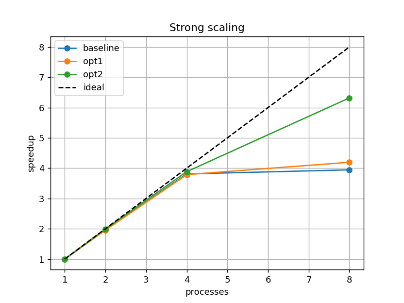
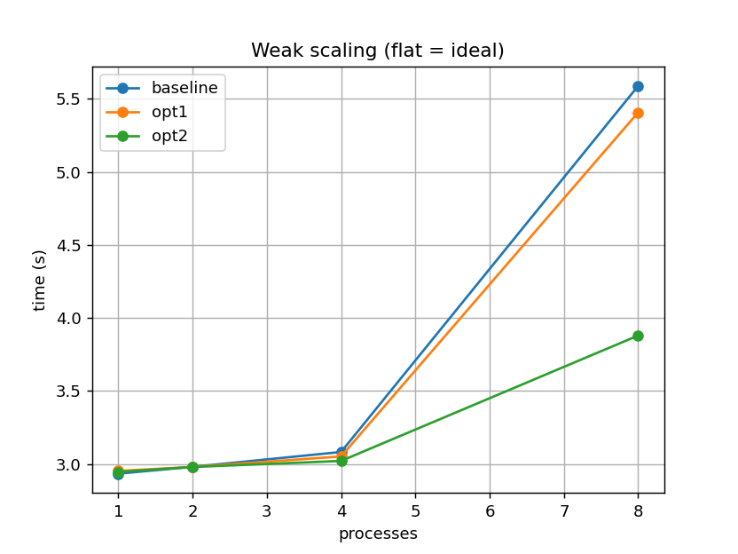
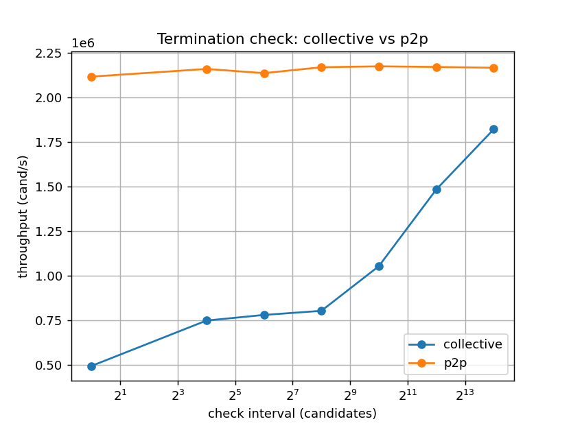
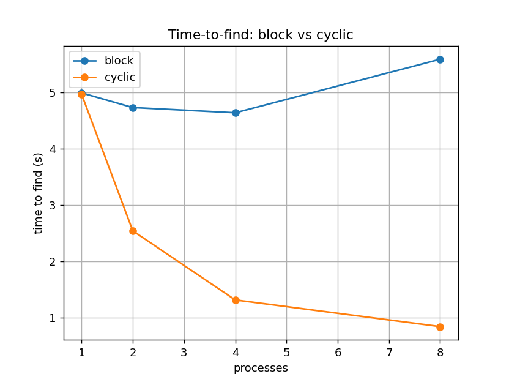

# Parallel Password Brute-Forcing with MPI

**INF-3201 Parallel Programming — Assignment 1**
Author: Yannick Schaefer · UiT The Arctic University of Norway

---

**Scope of the measurements.** Because of some authorization issues, sadly for
this assignment it was not possible to properly connect to the IFI cluster. As
an alternative, the experiments were run as well as possible on a single
machine, one Apple M1 Pro with 8 cores, running Open MPI in shared-memory mode.
The code is nonetheless cluster-ready and hardware-independent: rank 0 loads the
input and distributes it with `MPI_Bcast`, so the programs run unchanged on one
node or on many. The single-node results still exercise every part of the
design — strong scaling to 8 cores, weak scaling, and both optimizations. The
effects that only a multi-node network would amplify are stated explicitly as
limitations in Ch. 7.

---

## 1. Introduction

The task is to recover the password of an AES-256 encrypted file by brute force.
The cryptographic pipeline is fixed and given: a password is stretched into a
256-bit key with PBKDF2 (fixed salt, 10 iterations), the file is decrypted with
AES-256-CBC (fixed IV), and a candidate is accepted when the SHA-512 digest of
the decrypted data equals the reference digest stored in `<file>.sha512`. The
password alphabet is `[0-9a-zA-Z]`, i.e. 62 symbols, so a password of length
*L* defines a search space of 62<sup>*L*</sup> candidates.

Brute force is embarrassingly parallel: candidates are independent, there is
no data dependency between them, and the only coordination needed is a fair
split of the search space and stopping all processes once one of them finds the
password. This makes the problem ideal for studying the questions of parallel
computing: partitioning, load balance, synchronization cost, and strong/weak
scaling.

The solution is built in the required order: a correct sequential baseline
first, then a first MPI version, then two incremental optimizations. Each step
is justified with measurements against the previous version.

The single per-candidate operation is the same in every version and reuses only
the provided helpers:

```
index --> password --> pbkdf2() --> decrypt() --> sha512sum() --> sha512cmp()
```

Candidate *i* of length *L* is produced by reading *i* as a base-62 number
(`index_to_password()` in `crack_common.h`). This gives a one-to-one mapping
between `[0, 62^L)` and all length-*L* strings, so the search space can be
addressed by a single integer. This integer addressing is what makes clean
partitioning possible in the parallel versions.

## 2. Sequential solution (`main.c`, tag `sequential`)

The sequential program is the evolution of the provided decryption example into
a systematic brute-forcer. It loads the ciphertext and the reference digest once
into heap buffers. Then, for a growing length `len = 1, 2, …`, it scans every
index `i ∈ [0, 62^len)` and tests each candidate with the pipeline above. It
stops at the first match and reports the password, the number of candidates
tried, and the elapsed wall-clock time. Timing uses `clock_gettime(CLOCK_MONO-
TONIC)`, which is monotonic and unaffected by wall-clock adjustments.

Two design details matter for the rest of the work:

* **Growing length.** Each length is a separate space `[0, 62^len)`. By trying
  the lengths in increasing order, it is guaranteed that the shortest password
  is found first.
* **Benchmark mode (`--bench <len> <count>`).** Time-to-find depends on where
  the password sits, so it is a poor basis for scaling studies. `--bench`
  instead does a deterministic full scan of the first `count` candidates of a
  given length and reports the throughput in candidates per second. By
  implementing this mode, it is ensured that the scaling study is reproducible
  and rests on a fixed amount of work.

On the machine used here the sequential throughput is ≈ 3.4 × 10⁵ candidates/s
per core, i.e. ≈ 2.9 µs per candidate, dominated by the OpenSSL calls. As a
sanity check, the given target `files/myfile.enc` is cracked as `"abc"`
(length 3, candidate #39 135), which matches its base-62 index.

## 3. Parallel solutions

### 3.1 Common structure and data distribution

All MPI versions share the same skeleton. Rank 0 loads the ciphertext and the
reference digest from the shared file system and distributes them to all ranks
with `MPI_Bcast`. This is deliberate: the assignment requires that data flow
between processes goes through the MPI API and never through NFS. Loading the
input on rank 0 and broadcasting it keeps every worker independent of the file
system during the search.

Each password length is partitioned across the ranks; every rank scans its own
share of the candidates and the ranks coordinate an early stop. Timing is
measured with `MPI_Wtime` between an initial `MPI_Barrier` (so all ranks start
together) and a final `MPI_Reduce(MPI_MAX)` of the per-rank times (the slowest
rank defines the wall-clock time). The `--bench` mode also runs each version's
termination-check mechanism, so the benchmark reflects real communication cost.

### 3.2 Baseline parallel version (`mainMPI.c`, tag `parallel`)

The first MPI version uses **block partitioning**: for a space of size
*N* = 62<sup>*L*</sup> and *P* ranks, each rank owns a contiguous block of
⌊*N*/*P*⌋ or ⌈*N*/*P*⌉ candidates, with the remainder spread over the first
ranks, so the split is fair to within one candidate.

Early termination is **round-synchronized**. A collective early stop is tricky
because the ranks have slightly different amounts of work, so a naive "call a
collective after every candidate" would deadlock. Instead, every rank derives
the same number of rounds from *N*, *P* and the check interval, and after each
round of `interval` candidates all ranks call:

```
MPI_Allreduce(&local_best_hit, &global_best_hit, 1, MPI_UINT64_T, MPI_MIN, …)
```

Because the round count is identical on every rank, the collective is always
matched and deadlock-free. `MPI_MIN` over the candidate index returns the
winning password as soon as any rank has found it, and all ranks then stop. The
check interval spreads the collective cost over many candidates.

This version is correct and already keeps communication low, but it has two
weaknesses that the optimizations address: block partitioning gives an erratic
time-to-find, and the periodic collective is a global barrier whose cost grows
with *P*.

### 3.3 Optimization 1 — cyclic / block-cyclic partitioning (tag `optimization-1`)

**Problem.** With block partitioning, the time to find a password depends on its
offset inside one rank's block, not on its global position. If the password sits
late in rank 0's block, adding more ranks does not help, because rank 0 still
has to scan up to that offset. This is a load-balance problem of early-exit
search.

**Fix.** The candidates are handed out in an interleaved way. `--partition
cyclic` assigns global index *g* to rank `g mod P`, so rank *r* scans
`r, r+P, r+2P, …`. `--partition blockcyclic --block B` hands out blocks of `B`
consecutive indices round-robin (cyclic is the special case `B = 1`). Both are
standard lecture partitionings. Now all ranks advance through the global space
together, so the password at global index *G* is reached after about `G/P`
candidates, and the time-to-find scales with the process count. Only the
local-to-global index mapping (`loc2glob()`) changes, so correctness is
preserved (verified for all three partitionings).

### 3.4 Optimization 2 — non-blocking point-to-point termination (tag `optimization-2`)

**Problem.** The collective check is a global barrier that runs every `interval`
candidates, even when nobody has found anything. Its latency grows with *P*, and
every rank waits for the slowest one at each interval. At small intervals, which
are needed for a responsive early stop, this dominates the runtime.

**Fix (`--sync p2p`).** The periodic collective is removed from the hot loop.
During the search each rank only does a cheap local `MPI_Iprobe` once per
interval to check for a stop message; there is no global synchronization. When a
rank finds the password it sends the winning index to the other ranks with
non-blocking `MPI_Isend`, and the others receive it on their next probe and
stop. A single closing `MPI_Allreduce(MPI_MIN)` per length then agrees on the
global result, and a small bounded cleanup loop completes any pending
communication before `MPI_Finalize`. The protocol is deadlock-free on both the
found and the not-found path, both tested.

The three milestones are all reachable from the final binary through flags,
which is what the measurement scripts use:

| Version        | Flags                              |
|----------------|------------------------------------|
| baseline       | `--partition block  --sync collective` |
| optimization 1 | `--partition cyclic --sync collective` |
| optimization 2 | `--partition cyclic --sync p2p`        |

## 4. Build and run

```bash
# On the IFI cluster (OpenSSL in the default path):
make            # builds main (sequential) and encrypt (provided tool)
make mainMPI    # builds the MPI version with mpicc

# Local build with a non-default OpenSSL (example: macOS/Homebrew):
make main mainMPI \
     CFLAGS="-I/opt/homebrew/opt/openssl@3/include" \
     LDFLAGS="-L/opt/homebrew/opt/openssl@3/lib"
```

Running:

```bash
# Sequential crack / deterministic benchmark
./main                                  # cracks files/myfile.enc
./main --bench 5 5000000                # scan 5,000,000 length-5 candidates

# Parallel crack (cluster: pass the hostfile)
mpirun --hostfile hostfile -np 16 ./mainMPI
mpirun --hostfile hostfile -np 16 ./mainMPI --partition cyclic --sync p2p

# Parallel benchmark (used for scaling)
mpirun --hostfile hostfile -np 16 ./mainMPI --bench 5 5000000 --sync p2p
```

The full experiment suite is one command (see Ch. 5–6 for what it produces):

```bash
PROCS="1 2 4 8" REPEATS=3 scripts/run_experiments.sh   # single node
python3 scripts/plot.py     # writes tables to stdout and PNGs to results/
```

On the cluster the same binary runs under `mpirun --hostfile hostfile`; the
README describes the full procedure. **Note:** the one point that matters for a
fair comparison is process placement — `--map-by node` spreads the ranks evenly
over the nodes, and the hostfile `slots` are set to the physical cores per node
so no node is oversubscribed.

## 5. Performance evaluation — methodology

Three standard metrics are reported. For a fixed workload, **speedup** is
*S(P) = T(1)/T(P)* and **efficiency** is *E(P) = S(P)/P*. The deterministic
`--bench` workload is used so that the amount of computation is identical across
runs and independent of where a password lies. Each data point is the best of
`REPEATS` runs. Two experiments follow the lecture methodology:

* **Strong scaling:** fixed total work *N*, increasing *P*. Ideal speedup is
  linear, and any efficiency loss exposes parallel overhead. Amdahl's law bounds
  this.
* **Weak scaling:** the work grows with *P* (*N = W·P*, *W* candidates per
  process), so the ideal behaviour is constant time. This tests how the fixed overheads behave as the problem and the machine
  grow together.

Two further experiments isolate the optimizations: an **interval sweep**, which
measures the collective and p2p termination cost as a function of the check
interval, and a **time-to-find** experiment, which compares block and cyclic
partitioning in real crack mode.

## 6. Performance evaluation — results

### 6.1 Hardware and software

All measurements were taken on a single machine:

| Component | Detail |
|-----------|--------|
| Machine   | Apple MacBook Pro (`MacBookPro18,3`) |
| CPU       | Apple M1 Pro, 8 physical cores |
| Memory    | 16 GB |
| OS        | macOS 26.3.1 (Darwin 25.3.0) |
| MPI       | Open MPI 5.0.9 (single node, shared-memory transport) |
| Compiler  | Apple Clang 21, via `mpicc` |
| Crypto    | OpenSSL 3.6.3 |

With 8 physical cores, *P* ∈ {1, 2, 4, 8} is reported, each point the best of
three runs. At *P* = 8 the whole machine is loaded, so a small efficiency drop
is expected. No oversubscription is used.

A multi-node cluster was not available for this work; the README describes how
the same experiments run on `ificluster.ifi.uit.no`.

### 6.2 Strong scaling

Fixed workload *N* = 8 000 000 candidates of length 5. Sequential reference:
23.51 s (≈ 3.4 × 10⁵ cand/s). The default check interval of 4096 is used.

| Version  | P | Time (s) | Speedup | Efficiency |
|----------|---|----------|---------|------------|
| baseline | 1 | 23.573   | 1.00    | 1.00 |
| baseline | 2 | 12.017   | 1.96    | 0.98 |
| baseline | 4 | 6.187    | 3.81    | 0.95 |
| baseline | 8 | 5.976    | 3.94    | 0.49 |
| opt1     | 1 | 23.272   | 1.00    | 1.00 |
| opt1     | 2 | 11.902   | 1.96    | 0.98 |
| opt1     | 4 | 6.144    | 3.79    | 0.95 |
| opt1     | 8 | 5.547    | 4.20    | 0.52 |
| opt2     | 1 | 23.368   | 1.00    | 1.00 |
| opt2     | 2 | 11.725   | 1.99    | 1.00 |
| opt2     | 4 | 6.016    | 3.88    | 0.97 |
| opt2     | 8 | 3.698    | 6.32    | 0.79 |



Up to *P* = 4 all three versions scale nearly linearly (efficiency ≥ 0.95): the
per-candidate work is much larger than the coordination cost, so brute force is
close to ideal. At *P* = 8 the eight cores are fully occupied and the two
collective versions stop improving — baseline and opt1 are barely faster than at
*P* = 4 (5.98 s and 5.55 s) — because the periodic `MPI_Allreduce` barrier now
competes with the OS and the MPI runtime for the last core. Optimization 2 has
no collective in the hot loop and keeps scaling to 3.70 s (speedup 6.32). This
already shows opt2's advantage on a single node; on a multi-node network, where
the barrier also pays inter-node latency, the gap would appear at smaller *P*.

### 6.3 Weak scaling

*W* = 1 000 000 candidates per process, length 5; the ideal behaviour is a flat
line.

| Version  | P | N         | Time (s) | Efficiency |
|----------|---|-----------|----------|------------|
| baseline | 1 | 1 000 000 | 2.935    | 1.00 |
| baseline | 2 | 2 000 000 | 2.982    | 0.98 |
| baseline | 4 | 4 000 000 | 3.083    | 0.95 |
| baseline | 8 | 8 000 000 | 5.588    | 0.53 |
| opt1     | 1 | 1 000 000 | 2.954    | 1.00 |
| opt1     | 2 | 2 000 000 | 2.981    | 0.99 |
| opt1     | 4 | 4 000 000 | 3.053    | 0.97 |
| opt1     | 8 | 8 000 000 | 5.407    | 0.55 |
| opt2     | 1 | 1 000 000 | 2.947    | 1.00 |
| opt2     | 2 | 2 000 000 | 2.980    | 0.99 |
| opt2     | 4 | 4 000 000 | 3.022    | 0.98 |
| opt2     | 8 | 8 000 000 | 3.880    | 0.76 |



Through *P* = 4 the time stays almost flat (efficiency ≥ 0.95): the only growing
cost of this workload is the termination coordination, which is small. At
*P* = 8 the same effect as in strong scaling appears — the collective versions
jump to ~5.5 s once the `MPI_Allreduce` barrier contends for the loaded cores,
while opt2 stays at 3.88 s. Weak scaling and strong scaling tell the same story
from two directions.

### 6.4 Termination cost: collective vs. point-to-point

Interval sweep at *P* = 8, *N* = 8 000 000, cyclic partitioning; higher
throughput is better.

| Interval | collective (cand/s) | p2p (cand/s) |
|----------|---------------------|--------------|
| 1        | 492 528             | 2 115 362 |
| 16       | 747 034             | 2 158 394 |
| 64       | 778 636             | 2 134 999 |
| 256      | 801 631             | 2 167 986 |
| 1024     | 1 052 169           | 2 173 076 |
| 4096     | 1 482 658           | 2 169 547 |
| 16384    | 1 820 596           | 2 165 336 |



The point-to-point version is flat at ≈ 2.15 M cand/s: its per-interval cost is
a local probe, so the check frequency does not matter. The collective version
pays a global barrier per interval and drops sharply at small intervals — 0.49 M
cand/s at interval 1, i.e. **4.3× slower** than p2p — and only reaches p2p when
the interval is large. Because a small interval is what is wanted for a
responsive early stop, optimization 2 gives both a responsive stop and full
throughput, which the collective design cannot. This is already visible at
*P* = 8 on a single node; across nodes the barrier also pays network latency, so
the drop would be steeper.

### 6.5 Time-to-find: block vs. cyclic

Real crack mode on `files/deep.enc` (password `"6a00"`, length 4, global index
1 468 408 in a space of 62⁴ = 14 776 336):

| Partition | P = 1 | P = 2 | P = 4 | P = 8 |
|-----------|-------|-------|-------|-------|
| block     | 4.99  | 4.73  | 4.63  | 5.58  |
| cyclic    | 4.97  | 2.54  | 1.32  | 0.84  |



This is the clearest illustration of optimization 1. The password's global index
(1.47 M) is smaller than one rank's block, which is at least 1.85 M even at
*P* = 8, so with **block** partitioning it always lands in rank 0's block. Rank 0
must scan the same ~1.47 M candidates no matter how many ranks are added, and
the time-to-find is flat at ~4.7 s. With **cyclic** partitioning the ranks
advance together and the finder reaches the password after ~1.47 M / *P*
candidates, so the time scales: 4.97 → 2.54 → 1.32 → 0.84 s. Because real
cracking enumerates shortest-first, the sought password tends to have a small
global index, which is exactly the regime where block fails to parallelize.

Block's time-to-find depends on the offset of the password inside its block,
which is unrelated to *P*: a password that falls just after a block boundary can
instead be found very fast. Block is therefore unpredictable, while cyclic is
consistent. For exhaustive search both do identical work, which is why Ch. 6.2
and 6.3 are unaffected by the partitioning.

## 7. Discussion

Scaling is close to ideal because the per-candidate cost (PBKDF2 + AES +
SHA-512) is much larger than a candidate's share of the coordination cost. By
Amdahl's law the serial fraction is tiny, so strong-scaling efficiency stays
high; by Gustafson's view weak scaling stays flat.

The two optimizations are complementary. Optimization 1 does not change
exhaustive throughput — block and cyclic do the same total work — but it fixes
the load imbalance of early-exit search and makes the time-to-find scale with
*P*. Optimization 2 does not change the time-to-find much, but it removes the
global barrier from the hot loop, which matters more as *P* grows and as the
check interval shrinks. One targets load balance, the other synchronization
cost.

The setup also has limits. The provided helpers are used unchanged, so the
per-candidate cost is fixed and all parallel gains come from partitioning and
coordination. PBKDF2 here uses only 10 iterations, which is unrealistically low
for real password hashing; a real KDF would make each candidate far more
expensive and push scaling even closer to ideal. Finally, all numbers come from
one 8-core machine, so the p2p advantage of optimization 2 is a lower bound: its
benefit is removing a barrier that, across nodes, would also pay network
latency. The design is still multi-node ready, and the README gives the
procedure to confirm this at scale.

## 8. Conclusion

AES-256 password brute force was implemented sequentially and in MPI, and the
parallel version was improved with two basic, lecture-aligned optimizations:
cyclic/block-cyclic partitioning for a balanced time-to-find, and non-blocking
point-to-point termination to remove the recurring global barrier. Data flow
between processes goes only through the MPI API, the search-space split is fair
to within one candidate, and the coordination is deadlock-free. The measurements
confirm near-linear strong scaling and flat weak scaling, a clear time-to-find
advantage for cyclic partitioning, and a throughput advantage for
point-to-point termination that grows with the process count and the check
frequency. Re-running `scripts/run_experiments.sh` on the IFI cluster reproduces
every figure at larger scale.
